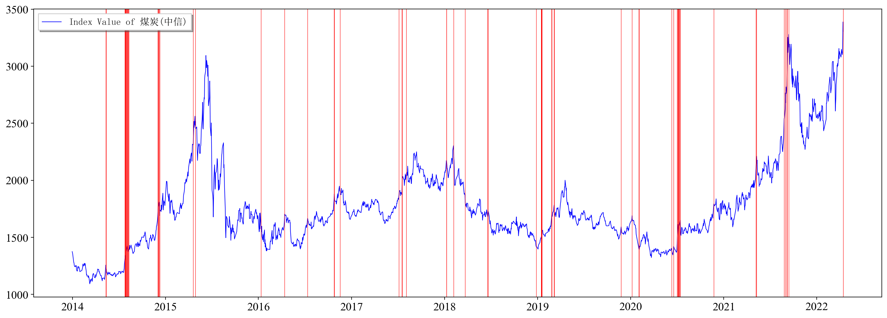
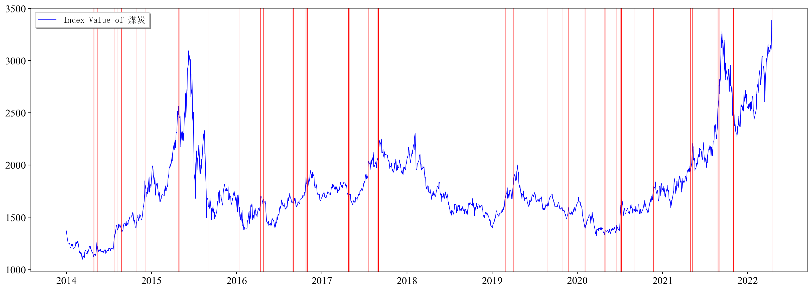

# Identification of Industry Congestions

## Why I did this?

When the transaction in some industries is overheating, it will bring a decline in absolute or relative returns. Therefore, investors should avoid highly crowded industries.

We should know that industry congestion is a trading phenomenon, which is more the result of investors' short-term emotion and is not directly related to industry fundamentals. Therefore, trading data can be used to measure congestion (volume, price and turnover). And we should also know that a large amount of factor might bring a higher chance of overfitting.

## How Industry Congestion Affects Returns Afterwards?

It is generally believed that when the price rises too much or the transaction amount increases too much, there will be more inflows, and this comes to a industry congestion.

Every trading day, group interval returns(>5%, >10%, 15%, ..., >50%) and compute a Pearson Correlation between close price of 60 trading days before and 60 trading days after. We also grouped trading amount and interval sum of trading amount(-120~-60 and -60~now), and the results are as below:

|                 | >0%    | >5%    | >10%   | >15%   | >20%   | >25%    | >30%    | >35%    | >40%    | >45%    | >50%    |
| --------------- | ------ | ------ | ------ | ------ | ------ | ------- | ------- | ------- | ------- | ------- | ------- |
| Close           | 0.0769 | 0.0739 | 0.0668 | 0.0453 | 0.0086 | -0.0325 | -0.0786 | -0.1090 | -0.1299 | -0.1401 | -0.1530 |
| Amount          | 0.0697 | 0.0679 | 0.0672 | 0.0658 | 0.0642 | 0.0626  | 0.0605  | 0.0583  | 0.0559  | 0.0533  | 0.0511  |
| Interval Amount | 0.0815 | 0.0808 | 0.0799 | 0.0795 | 0.0781 | 0.0771  | 0.0769  | 0.0765  | 0.0777  | 0.0795  | 0.0789  |

## How to Compute Mahalanobis Distance?

Please refer to links below:

- [马氏距离——直观理解与公式推导 - 知乎 (zhihu.com)](https://zhuanlan.zhihu.com/p/109100222)
- [马氏距离(Mahalanobis Distance) - 知乎 (zhihu.com)](https://zhuanlan.zhihu.com/p/46626607)

## Can Mahalanobis Distance Reflect Industry Congestions and Drawdowns?

- I assume that when the Mahalanobis Distance exceeds 12(a constant), the index reaches a phased high. The plots below shows that this method can locate phased high quite accurately.
I also made a summary of the absolute and relative winning percentage. Taking 2014 as the starting point, I compared the industry growth in the next 60 days after the congestion signal is triggered with that of the benchmark index. If the increase of the industry is less than 0, it is considered to be absolutely correct; If the industry loses the benchmark index, it is considered to be relatively correct.

|          | CI005001.WI | CI005002.WI | CI005004.WI | CI005008.WI | CI005010.WI | CI005009.WI | CI005007.WI | CI005006.WI | CI005005.WI | CI005003.WI | CI005027.WI | CI005028.WI | CI005026.WI | CI005025.WI | CI005024.WI | CI005023.WI | CI005021.WI | CI005020.WI | CI005019.WI | CI005018.WI | CI005017.WI | CI005016.WI | CI005015.WI | CI005014.WI | CI005013.WI | CI005012.WI | CI005011.WI | CI005259.WI | CI005166.WI | CI005165.WI |
| -------- | ----------- | ----------- | ----------- | ----------- | ----------- | ----------- | ----------- | ----------- | ----------- | ----------- | ----------- | ----------- | ----------- | ----------- | ----------- | ----------- | ----------- | ----------- | ----------- | ----------- | ----------- | ----------- | ----------- | ----------- | ----------- | ----------- | ----------- | ----------- | ----------- | ----------- |
| Absolute | 58.46%      | 52.94%      | 49.18%      | 40.48%      | 50.00%      | 38.30%      | 54.84%      | 46.43%      | 46.97%      | 50.94%      | 53.49%      | 54.24%      | 51.43%      | 37.50%      | 57.14%      | 57.33%      | 48.65%      | 40.82%      | 23.26%      | 29.79%      | 52.63%      | 24.39%      | 39.02%      | 50.00%      | 54.84%      | 45.31%      | 38.10%      | 60.00%      | 36.49%      | 51.28%      |
| Relative | 63.08%      | 69.12%      | 39.34%      | 42.86%      | 42.86%      | 38.30%      | 48.39%      | 28.57%      | 56.06%      | 66.04%      | 51.16%      | 61.02%      | 45.71%      | 53.13%      | 44.90%      | 57.33%      | 59.46%      | 26.53%      | 53.49%      | 29.79%      | 36.84%      | 36.59%      | 51.22%      | 40.91%      | 48.39%      | 51.56%      | 35.71%      | 60.00%      | 39.19%      | 52.56%      |

- I also computed industry Mahalanobis Distance by grouping stocks. The Mahalanobis Distance of an industry now is the mean of distance of stocks which belong to this industry. I also added PE (now has close price, trading volume and PE) to compute the distance.

|          | CI005001.WI | CI005002.WI | CI005004.WI | CI005008.WI | CI005010.WI | CI005009.WI | CI005007.WI | CI005006.WI | CI005005.WI | CI005003.WI | CI005027.WI | CI005028.WI | CI005026.WI | CI005025.WI | CI005024.WI | CI005023.WI | CI005021.WI | CI005020.WI | CI005019.WI | CI005018.WI | CI005017.WI | CI005016.WI | CI005015.WI | CI005014.WI | CI005013.WI | CI005012.WI | CI005011.WI | CI005259.WI | CI005166.WI | CI005165.WI |
| -------- | ----------- | ----------- | ----------- | ----------- | ----------- | ----------- | ----------- | ----------- | ----------- | ----------- | ----------- | ----------- | ----------- | ----------- | ----------- | ----------- | ----------- | ----------- | ----------- | ----------- | ----------- | ----------- | ----------- | ----------- | ----------- | ----------- | ----------- | ----------- | ----------- | ----------- |
| Absolute | 44.94%      | 49.17%      | 53.13%      | 50.00%      | 51.85%      | 35.21%      | 53.52%      | 54.84%      | 53.33%      | 65.75%      | 46.25%      | 57.32%      | 45.07%      | 44.62%      | 55.26%      | 43.75%      | 47.90%      | 31.58%      | 17.46%      | 26.09%      | 53.33%      | 31.33%      | 45.33%      | 51.81%      | 39.39%      | 54.84%      | 45.59%      | 51.96%      | 32.43%      | 50.81%      |
| Relative | 57.30%      | 56.67%      | 59.38%      | 46.97%      | 46.91%      | 45.07%      | 61.97%      | 48.39%      |             |             |             |             |             |             |             |             |             |             |             |             |             |             |             |             |             |             |             |             |             |             |

## References

[1]20220418_华西证券 金融工程专题 张立宁杨国平 【华西金工】金融工程专题报告：使用更简单指标更有效地识别行业拥挤

##  
